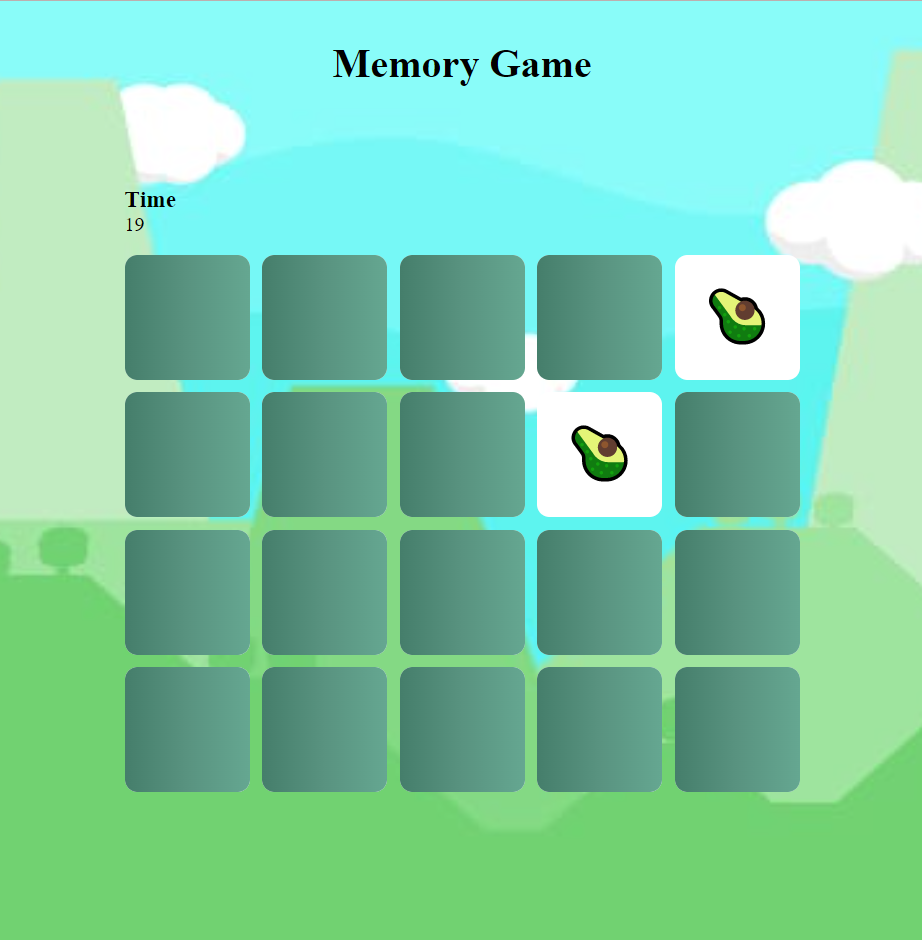

<h1>Memory Game</h1>

can play this game when you <a href="https://aaya-ahmed.github.io/memory-game/" target="_blank" >click here</a>

<h1>Contributing</h1>
<ul>
    <li>Fork the repository.</li>
    <li>Create a branch (e.g.feature) for the work you’re going to do.</li>
    <li>Make your awesome changes in your topic branch.</li>
    <li>Send a pull request from your branch to this repository.</li>
</ul>
<h1>Running locally</h1>
Just open the index.html file in a browser. No frameworks needed.
